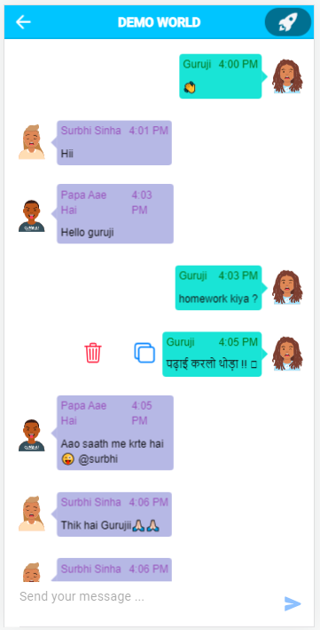

#       **[FIND ME](https://find-me0.web.app)**  
## A WORLD AWAY FROM WORLD
A platform which provides you the option to make a world and add your loved ones to that world.
You can either create a open world, of which everyone could be a part of, or you can lock your world and allow only your favourite ones.
With crazy user names , comes the crazy Avatars.Get your favourite Avatars! 
#### **[Register Now !! ](https://find-me0.web.app)**

## Screen-Shots

Welcome          |  Login
:-------------------------:|:-------------------------:
|
Create World          |  Join World
|
View World          |  Chat 
|
Add Members          |  View Members 
|
Settings | About App
|

  

## Technolgy Used

**Client:** [Angular](https://angular.io/), [Ionic](https://ionicframework.com/docs/angular/overview) ,  [Socket.io Client-side](https://socket.io/docs/v4/client-api/)

**Server:** [TypeScript](https://www.typescriptlang.org/), [ Node.js](https://nodejs.org/en/docs/), [Express](https://www.npmjs.com/package/express) ,[ Socket.io Server-side](https://socket.io/docs/v4/server-api/)

  
## Deployment
 To deploy this project run
 
```bash
 ionic serve
```

To deploy this project run

```bash
  npm run deploy
```

  
## Developers

[@shivam101gaur](https://www.github.com/shivam101gaur)

  